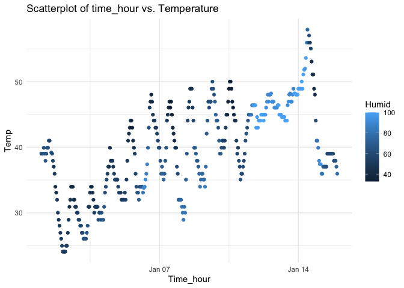

p8105_hw1_rh3195
================
Ruijie He
2023-09-23

## Problem 1

``` r
library ("moderndive")
data("early_january_weather")
```

\#variables in dataset

``` r
variables <- colnames(early_january_weather)
variables
```

    ##  [1] "origin"     "year"       "month"      "day"        "hour"      
    ##  [6] "temp"       "dewp"       "humid"      "wind_dir"   "wind_speed"
    ## [11] "wind_gust"  "precip"     "pressure"   "visib"      "time_hour"

\#Size of dataset

``` r
num_rows <- nrow(early_january_weather)
num_cols <- ncol(early_january_weather)
num_rows
```

    ## [1] 358

``` r
num_cols
```

    ## [1] 15

``` r
mean_temp <- mean (early_january_weather$temp)
mean_temp
```

    ## [1] 39.58212

- There are 15 variables in this dataset. Some important variables
  including year, month, day, and time_hour that tells the time. The
  wind direction, wind speed, and wind-gust that is related to the wind.
  Also the “temp” tells temperature and “humid” tells the humidity. It
  has 358 rows and 15 columns. The mean temperature is 39.58 degree.

\#Making scatterplot of temp (y) vs. time_hour (x)

``` r
library (ggplot2)

ggplot(early_january_weather, aes(x = time_hour, y = temp, color = humid)) +
  geom_point() +
  labs(x = "Time_hour", y = "Temp", color = "Humid") +
  ggtitle("Scatterplot of time_hour vs. Temperature") +
  theme_minimal()
```

<!-- -->
\##Describe pattern of scatterplot##

- The scatterplot shows that the two variables time_hour and tempeartue
  are having a positive association. Because as the temperature
  increases as the time_hour do. And the data points on this plot are
  assembled closely nearly to a linear line, which illustrating a linear
  relationship.

``` r
ggsave("scatterplot_of_time_vs_temperature.pdf", width = 6, height =4)
```

## Problem 2

``` r
library (tidyverse)
```

    ## ── Attaching core tidyverse packages ──────────────────────── tidyverse 2.0.0 ──
    ## ✔ dplyr     1.1.3     ✔ readr     2.1.4
    ## ✔ forcats   1.0.0     ✔ stringr   1.5.0
    ## ✔ lubridate 1.9.2     ✔ tibble    3.2.1
    ## ✔ purrr     1.0.2     ✔ tidyr     1.3.0
    ## ── Conflicts ────────────────────────────────────────── tidyverse_conflicts() ──
    ## ✖ dplyr::filter() masks stats::filter()
    ## ✖ dplyr::lag()    masks stats::lag()
    ## ℹ Use the conflicted package (<http://conflicted.r-lib.org/>) to force all conflicts to become errors

``` r
my_df =
  tibble(
    vec_numeric = rnorm (10),
   vec_logical = vec_numeric > 0,
   vec_char = c("A", "B", "C", "D", "E", "F", "G", "H", "I", "J"),
   vec_factor = factor(
     sample(c("L0", "L1", "L2"), 10, rep = TRUE)
   )
  )
print (my_df)
```

    ## # A tibble: 10 × 4
    ##    vec_numeric vec_logical vec_char vec_factor
    ##          <dbl> <lgl>       <chr>    <fct>     
    ##  1      -0.767 FALSE       A        L2        
    ##  2       1.05  TRUE        B        L1        
    ##  3       0.612 TRUE        C        L2        
    ##  4      -0.515 FALSE       D        L2        
    ##  5      -1.79  FALSE       E        L2        
    ##  6      -0.101 FALSE       F        L0        
    ##  7      -0.309 FALSE       G        L0        
    ##  8       0.873 TRUE        H        L1        
    ##  9      -0.247 FALSE       I        L1        
    ## 10       2.25  TRUE        J        L2

``` r
mean_numeric = mean(pull(my_df, vec_numeric))
mean_logical = mean(pull(my_df, vec_logical))
mean_char = mean(pull(my_df, vec_char))
```

    ## Warning in mean.default(pull(my_df, vec_char)): argument is not numeric or
    ## logical: returning NA

``` r
mean_factor = mean(pull(my_df, vec_factor))
```

    ## Warning in mean.default(pull(my_df, vec_factor)): argument is not numeric or
    ## logical: returning NA

``` r
print (mean_numeric)
```

    ## [1] 0.1054236

``` r
print (mean_logical)
```

    ## [1] 0.4

``` r
print (mean_char)
```

    ## [1] NA

``` r
print (mean_factor)
```

    ## [1] NA

- The variable of vec_numeric and vec_logical have mean. Charactor
  variable and factor variable do not generates mean because they are
  not numeric number or logical.

``` r
as.numeric(pull(my_df, vec_logical))
as.numeric(pull(my_df, vec_char))
as.numeric(pull(my_df, vec_factor))
```

- The vec_logical is converted to binary datapoints where 0 is false and
  1 is true. The vec_factor also get translated to 3 categories based on
  given lavels. The only variable that is unable to convert to numeric
  is the vec_char. This helps me to understand what happens when trying
  to take the mean. It tells that mean should be numeric numbers.
